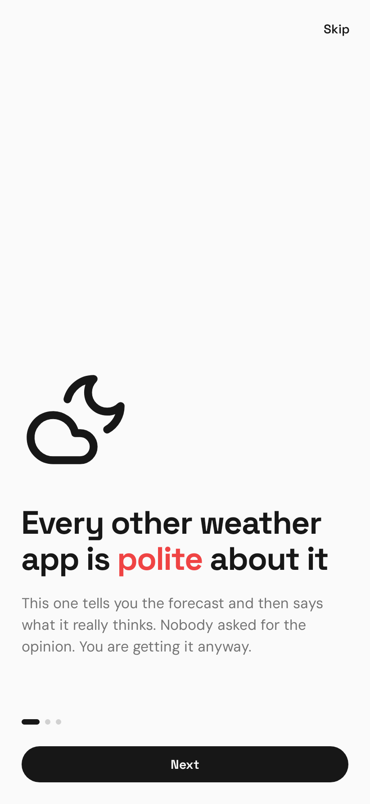
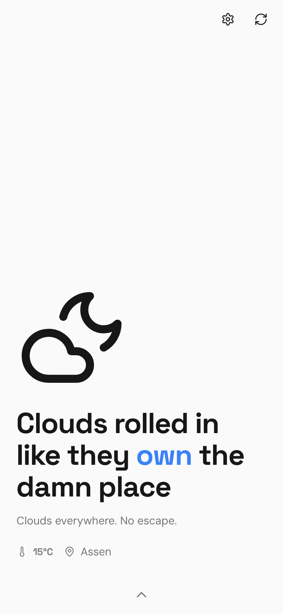
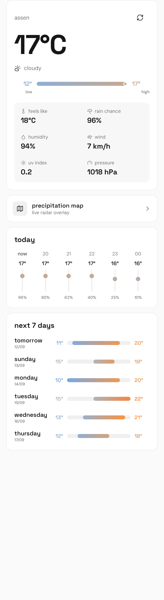
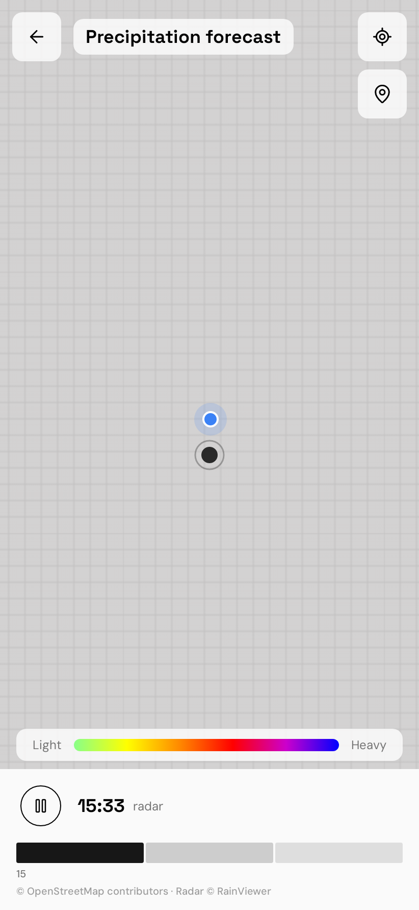
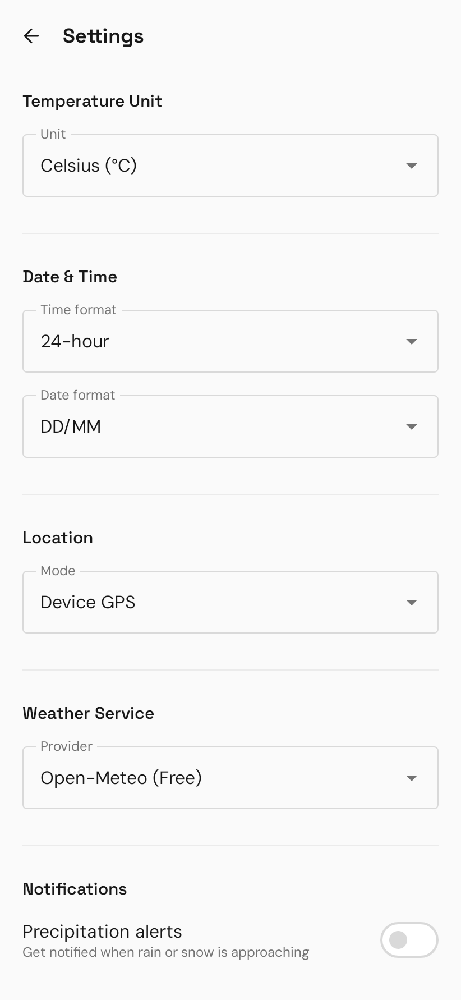

# Weather Quips — Android

Brutally honest weather forecasts with live radar, as a native Android app.

This repository contains the native Android conversion of the original
Weather-Quips React/Express PWA. The Android app is a real Kotlin/Compose
application — there is no WebView, no bundled web assets, and no dependency on
the Express backend.

| Onboarding | Home | Detail panel | Radar | Settings |
| --- | --- | --- | --- | --- |
|  |  |  |  |  |

## Build

```bash
cd android
./gradlew assembleDebug          # debug APK
./gradlew test                   # unit + host UI tests
./gradlew connectedAndroidTest   # instrumentation tests (needs a device)
./gradlew assembleRelease        # minified, unsigned release APK
```

The debug APK is written to:

```
android/app/build/outputs/apk/debug/app-debug.apk
```

`android/local.properties` must point at an Android SDK (`sdk.dir=...`); the
project targets SDK 35 and needs JDK 17+.

## Layout

```
android/                     native Android app (the product)
  app/src/main/java/com/weatherquips/app/
    data/       api/ model/ repository/ local/
    domain/     model/ repository/ quotes/
    ui/         navigation/ home/ precipitation/ settings/ components/ theme/
    location/   notifications/ utils/
web-reference/               the original PWA, kept for reference only
docs/screenshots/            rendered screens
```

## Architecture

```
Compose UI → ViewModel (StateFlow) → Repository → Retrofit/OkHttp → provider
```

- **No DI framework.** The graph is small and singleton-scoped, so a hand-rolled
  `AppContainer` created in `WeatherQuipsApplication` is enough; ViewModels are
  built by `viewModelFactory` initialisers that read it from the Application.
- **One weather model.** Every provider (Open-Meteo, OpenWeatherMap, WeatherAPI)
  normalizes into `WeatherData`, so the UI never learns which one is in use.
  Open-Meteo is the default because it needs no API key.
- **Quotes live in the app.** `FunnyQuotes` holds the exact content the Express
  server used to serve, so the app has no backend at all.
- **DataStore for settings**, with the third-party API key encrypted by an
  Android Keystore AES/GCM key before it is written to disk.
- **Offline-first.** The last successful result is cached as JSON and shown
  (clearly labelled as saved) whenever a fetch fails.
- **osmdroid for the map**, with RainViewer frames as a real tile overlay.

## APIs used

| Service | Purpose | Key |
| --- | --- | --- |
| [Open-Meteo](https://open-meteo.com) | Default weather provider | none |
| [OpenWeatherMap](https://openweathermap.org/api) | Optional provider | user-supplied |
| [WeatherAPI](https://www.weatherapi.com) | Optional provider | user-supplied |
| [Nominatim](https://nominatim.openstreetmap.org) | Forward + reverse geocoding | none |
| [RainViewer](https://www.rainviewer.com/api.html) | Radar tiles and timeline | none |
| [OpenStreetMap](https://www.openstreetmap.org) | Base map tiles (via osmdroid) | none |

## Permissions

| Permission | Why |
| --- | --- |
| `INTERNET`, `ACCESS_NETWORK_STATE` | Fetching weather, geocoding and map tiles |
| `ACCESS_COARSE_LOCATION`, `ACCESS_FINE_LOCATION` | "Device GPS" location mode; both optional — manual city selection works without them |
| `POST_NOTIFICATIONS` | Precipitation alerts (requested only when the toggle is switched on) |
| `WRITE_EXTERNAL_STORAGE` (≤ API 28) | osmdroid's tile cache on older releases |

## Licences

Bundled fonts are Space Grotesk and DM Sans, both SIL Open Font License; the
licence texts ship in `app/src/main/assets/`. The weather glyphs are the lucide
icon set (ISC), converted to Android vector drawables.
