# Weather Quips — Android

Brutally honest weather forecasts with live radar, as a native Android app.

This repository contains the native Android conversion of the original
Weather-Quips React/Express PWA. The Android app is a real Kotlin/Compose
application — there is no WebView, no bundled web assets, and no dependency on
the Express backend.

| Onboarding | Home | Detail panel | Radar | Settings |
| --- | --- | --- | --- | --- |
| 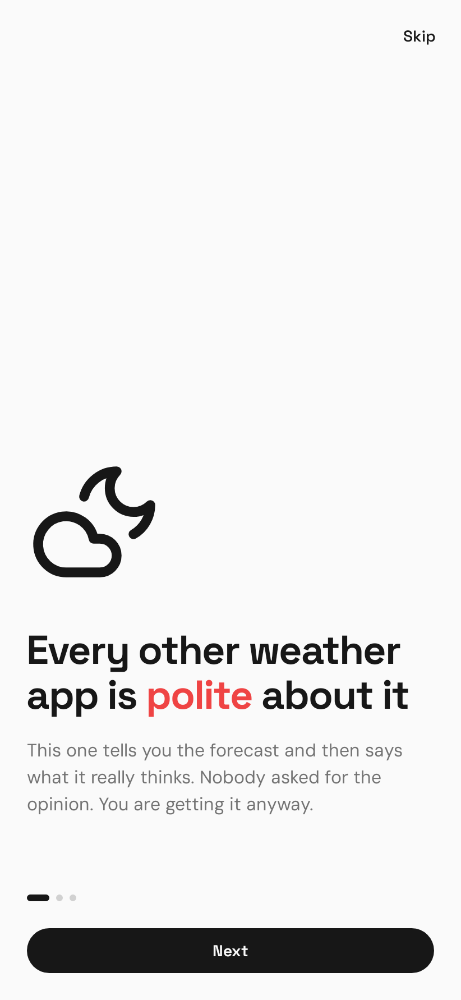 | 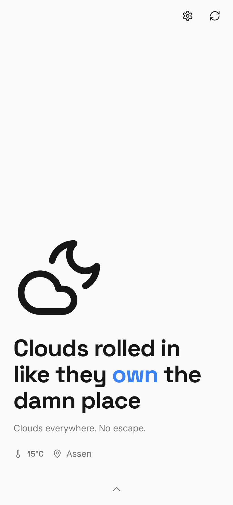 | 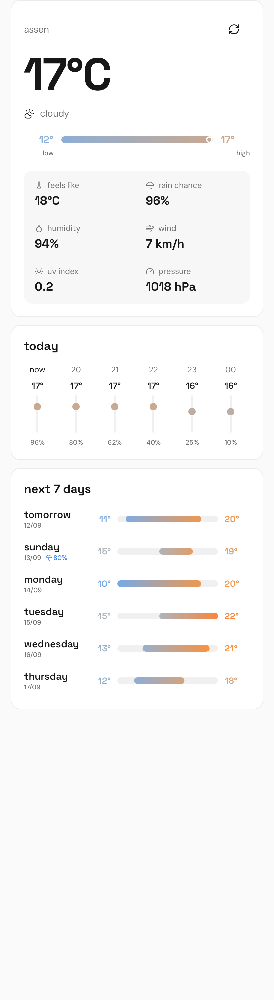 | 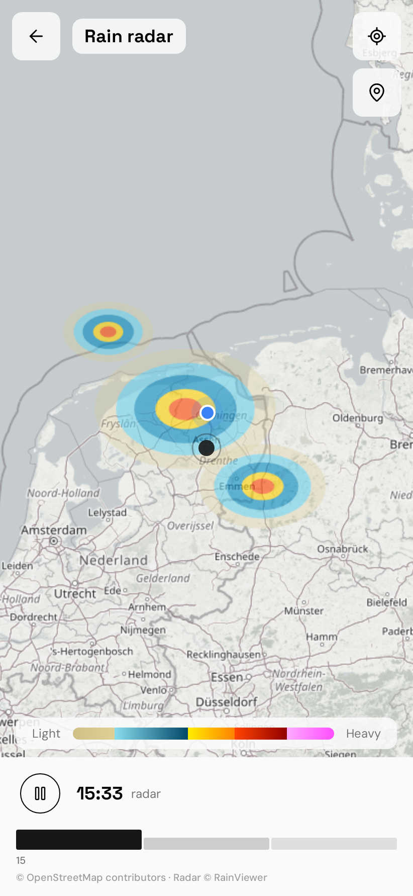 | 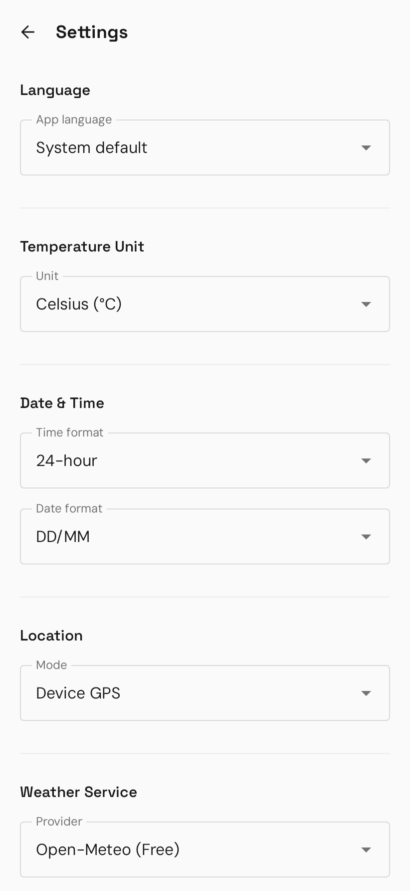 |

Tap a day in the week for its rain: how much, how likely, when, how hard and
for how long, with the day hour by hour. The app speaks English and Dutch, and
Settings → About lists every service, library and licence it uses.

| Day rain | In Dutch | About |
| --- | --- | --- |
| 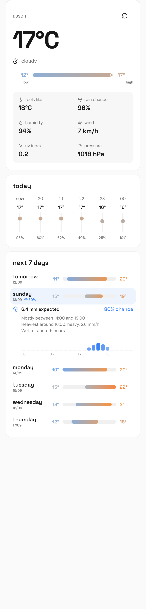 | 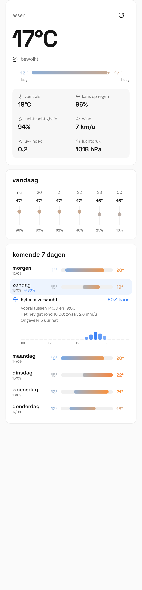 | 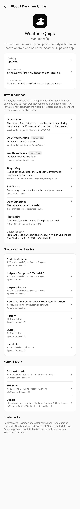 |

The home-screen widget graphs precipitation intensity for the next two hours,
leads with the fact and follows with a joke that suits the weather and the hour:

| Light | Dark | Narrow, Dutch |
| --- | --- | --- |
| 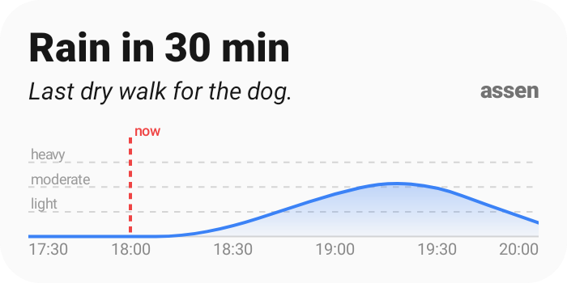 | 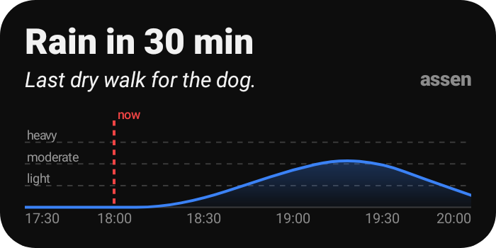 | 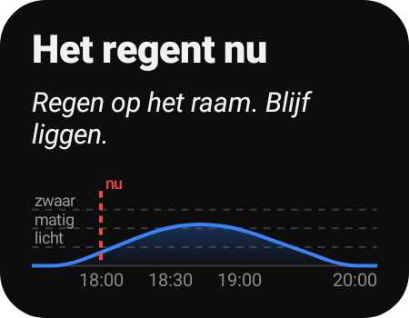 |

## Build

```bash
cd android
./gradlew assembleDebug          # debug APK
./gradlew test                   # unit + host UI tests
./gradlew connectedAndroidTest   # instrumentation tests (needs a device)
./gradlew assembleRelease        # minified, unsigned release APK
```

The debug APK is written to:

```
android/app/build/outputs/apk/debug/app-debug.apk
```

`android/local.properties` must point at an Android SDK (`sdk.dir=...`); the
project targets SDK 35 and needs JDK 17+.

## Layout

```
android/                     native Android app (the product)
  app/src/main/java/com/weatherquips/app/
    data/       api/ model/ repository/ local/
    domain/     model/ repository/ quotes/
    ui/         navigation/ home/ precipitation/ settings/ about/ components/ theme/
    widget/     Glance widget, graph renderer, quip selection
    locale/     per-app language
    text/       resource lookups for quips, labels and numbers
    location/   notifications/ utils/
  app/src/main/res/
    values/     English: strings, quotes, pokemon, alerts, widget
    values-nl/  Dutch, file for file
web-reference/               the original PWA, kept for reference only
docs/screenshots/            rendered screens
```

## Architecture

```
Compose UI → ViewModel (StateFlow) → Repository → Retrofit/OkHttp → provider
```

- **No DI framework.** The graph is small and singleton-scoped, so a hand-rolled
  `AppContainer` created in `WeatherQuipsApplication` is enough; ViewModels are
  built by `viewModelFactory` initialisers that read it from the Application.
- **One weather model.** Every provider (Open-Meteo, OpenWeatherMap, WeatherAPI)
  normalizes into `WeatherData`, so the UI never learns which one is in use.
  Open-Meteo is the default because it needs no API key.
- **Quotes live in resources.** Every quip, alert and widget joke is a string
  array in `res/values*/`, so the app has no backend and every line can be
  translated. A forecast caches a *seed*, not the text, so a language switch
  redraws even a cached forecast in the new language.
- **Per-app language** follows Android's recommendation: `LocaleManager` on
  Android 13+ (the app also appears under system Settings → Languages), a
  wrapped base context below that. `generateLocaleConfig` derives the language
  list from the `values-*` folders, and language splits are off in app bundles
  so switching never finds a language missing.
- **DataStore for settings**, with the third-party API key encrypted by an
  Android Keystore AES/GCM key before it is written to disk.
- **Offline-first.** The last successful result is cached as JSON and shown
  (clearly labelled as saved) whenever a fetch fails.
- **osmdroid for the map, with the radar drawn by its own overlay.** Every
  frame's tiles are kept, so changing frames never empties the map, and
  playback waits for the next frame's tiles instead of stepping onto a blank
  one. RainViewer publishes a frame every ten minutes; consecutive frames are
  cross-faded across most of each step so the rain moves rather than jumps.
  RainViewer renders radar down to zoom 7 only, so deeper zooms scale those
  tiles up.

## Adding content

- **A widget joke:** add an `<item>` to any `widget_quips_<mood>_<day|night>`
  array in `res/values/widget.xml` (and its Dutch twin). No code changes; the
  widget deals each pool out like a deck, a line per hour, never the same one
  twice running. `WidgetQuipsTest` checks every line fits two lines on the
  narrow widget.
- **A home-screen quip:** the same, in `res/values/quotes.xml`. Mark the one
  highlighted word with `**word**`.
- **A language:** copy `res/values/` to `res/values-<tag>/`, translate, and
  add the tag to `AppLanguage` and to `resourceConfigurations` in
  `app/build.gradle.kts`. `LocalizationTest` fails until every string, array
  item and plural exists and every placeholder matches.

## APIs used

| Service | Purpose | Key |
| --- | --- | --- |
| [Open-Meteo](https://open-meteo.com) | Default weather provider, including daily rain totals and hours | none |
| [OpenWeatherMap](https://openweathermap.org/api) | Optional provider | user-supplied |
| [WeatherAPI](https://www.weatherapi.com) | Optional provider | user-supplied |
| [Nominatim](https://nominatim.openstreetmap.org) | Forward + reverse geocoding | none |
| [RainViewer](https://www.rainviewer.com/api.html) | Radar tiles and timeline: the past two hours, one frame per ten minutes | none |
| [Bright Sky](https://brightsky.dev) | DWD radar composite and nowcast for the widget (Germany and neighbours) | none |
| [OpenStreetMap](https://www.openstreetmap.org) | Base map tiles (via osmdroid) | none |

## Permissions

| Permission | Why |
| --- | --- |
| `INTERNET`, `ACCESS_NETWORK_STATE` | Fetching weather, geocoding and map tiles |
| `ACCESS_COARSE_LOCATION`, `ACCESS_FINE_LOCATION` | "Device GPS" location mode; both optional — manual city selection works without them |
| `POST_NOTIFICATIONS` | Precipitation alerts (requested only when the toggle is switched on) |
| `WRITE_EXTERNAL_STORAGE` (≤ API 28) | osmdroid's tile cache on older releases |

## Licences

Bundled fonts are Space Grotesk and DM Sans, both SIL Open Font License. The
weather glyphs are the lucide icon set (ISC; the Feather-derived arrows and
chevrons MIT), converted to Android vector drawables. The libraries are
Apache 2.0. All four licence texts ship in `app/src/main/assets/` and can be
read in the app under Settings → About. `AboutTest` fails if the app contacts
a host or depends on a library that the About page does not credit.
